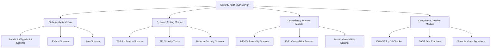

# Security Audit MCP Server Plan

This document outlines a comprehensive plan for building an MCP server that provides security auditing capabilities across multiple languages (JavaScript, Python, and Java) and their frameworks. This server will integrate various security tools to provide static analysis, dynamic testing, dependency scanning, and compliance checking.

## 1. Architecture Overview

The high-level architecture for our Security Audit MCP server:



## 2. Tools Integration

The MCP server will integrate the following open-source security tools:

### Static Analysis Tools
- **ESLint with security plugins** - For JavaScript/TypeScript
- **Bandit** - For Python
- **SpotBugs with Find Security Bugs** - For Java
- **SonarQube** - For multi-language support

### Dynamic Testing Tools
- **OWASP ZAP (Zed Attack Proxy)** - For web application and API security testing
- **Nuclei** - For vulnerability scanning templates

### Dependency Scanners
- **OWASP Dependency-Check** - For multiple languages
- **npm audit** - For JavaScript/Node.js
- **Safety** - For Python
- **OWASP Dependency-Track** - For tracking and managing vulnerabilities

### Compliance Checkers
- **OWASP ZAP** with custom rules for OWASP Top 10
- **Security Headers** - For checking HTTP security headers
- **TLS Checker** - For SSL/TLS configuration

## 3. MCP Server Tools and Resources

The MCP server will expose the following tools and resources:

### Tools

1. **`scan_code_security`**
   - Performs static code analysis on a codebase
   - Parameters: repository path, language(s), scan depth

2. **`scan_dependencies`**
   - Scans project dependencies for known vulnerabilities
   - Parameters: project path, package manager type

3. **`scan_live_application`**
   - Performs dynamic security testing on a live application
   - Parameters: URL, scan type (passive/active), authentication details

4. **`check_compliance`**
   - Checks compliance with security standards
   - Parameters: target (code/application), standard (OWASP Top 10, etc.)

5. **`generate_security_report`**
   - Generates a comprehensive security report
   - Parameters: scan results, report format

### Resources

1. **`security://vulnerabilities/{scan_id}`**
   - Provides detailed information about vulnerabilities found in a scan

2. **`security://recommendations/{vulnerability_id}`**
   - Provides remediation recommendations for specific vulnerabilities

3. **`security://compliance/{standard}`**
   - Provides compliance information for specific security standards

## 4. Implementation Plan

Here's a step-by-step plan for implementing the Security Audit MCP server:

### Phase 1: Setup and Basic Structure
1. Create the MCP server project structure
2. Implement the core server functionality
3. Set up Docker containers for the security tools

### Phase 2: Static Analysis Integration
1. Integrate ESLint with security plugins
2. Integrate Bandit for Python
3. Integrate SpotBugs for Java
4. Implement the `scan_code_security` tool

### Phase 3: Dependency Scanning
1. Integrate OWASP Dependency-Check
2. Implement language-specific dependency scanners
3. Implement the `scan_dependencies` tool

### Phase 4: Dynamic Testing
1. Integrate OWASP ZAP
2. Implement API and web application scanning
3. Implement the `scan_live_application` tool

### Phase 5: Compliance Checking
1. Implement OWASP Top 10 compliance checking
2. Implement security headers and configuration checking
3. Implement the `check_compliance` tool

### Phase 6: Reporting and Integration
1. Implement the report generation functionality
2. Create the resource endpoints
3. Finalize the MCP server configuration

## 5. Technical Implementation Details

### Core Server Structure

```
security-audit-server/
├── package.json
├── tsconfig.json
├── src/
│   ├── index.ts                  # Main server entry point
│   ├── tools/                    # Tool implementations
│   │   ├── static-analysis.ts
│   │   ├── dependency-scan.ts
│   │   ├── dynamic-testing.ts
│   │   ├── compliance-check.ts
│   │   └── report-generator.ts
│   ├── resources/                # Resource implementations
│   │   ├── vulnerabilities.ts
│   │   ├── recommendations.ts
│   │   └── compliance.ts
│   ├── integrations/             # Tool integrations
│   │   ├── eslint/
│   │   ├── bandit/
│   │   ├── spotbugs/
│   │   ├── dependency-check/
│   │   ├── zap/
│   │   └── nuclei/
│   └── utils/                    # Utility functions
│       ├── docker.ts
│       ├── report.ts
│       └── config.ts
└── docker/                       # Docker configurations for tools
    ├── zap/
    ├── dependency-check/
    └── sonarqube/
```

### Key Implementation Considerations

1. **Docker Integration**: We'll use Docker to run the security tools, which ensures consistent environments and easy setup.

2. **Asynchronous Processing**: Security scans can be time-consuming, so we'll implement asynchronous processing with status updates.

3. **Result Caching**: We'll cache scan results to avoid redundant scans and improve performance.

4. **Extensibility**: The architecture will be modular to allow easy addition of new security tools and scanners.

5. **Configuration Management**: We'll provide flexible configuration options for each security tool.

## 6. Example Usage Scenarios

Here are some example scenarios of how the MCP server would be used:

### Scenario 1: Static Code Analysis

```
// User request
"Scan my JavaScript project for security vulnerabilities"

// MCP tool call
use_mcp_tool({
  server_name: "security-audit",
  tool_name: "scan_code_security",
  arguments: {
    path: "/path/to/project",
    languages: ["javascript"],
    scan_depth: "standard"
  }
})

// Result
{
  "scan_id": "abc123",
  "vulnerabilities_count": 5,
  "critical": 1,
  "high": 2,
  "medium": 1,
  "low": 1,
  "summary": "Found 5 security issues including 1 critical XSS vulnerability",
  "details_resource": "security://vulnerabilities/abc123"
}
```

### Scenario 2: Live Application Testing

```
// User request
"Test the security of my deployed application at https://example.com"

// MCP tool call
use_mcp_tool({
  server_name: "security-audit",
  tool_name: "scan_live_application",
  arguments: {
    url: "https://example.com",
    scan_type: "passive",
    include_apis: true
  }
})

// Result
{
  "scan_id": "xyz789",
  "vulnerabilities_count": 3,
  "critical": 0,
  "high": 1,
  "medium": 2,
  "low": 0,
  "summary": "Found 3 security issues including 1 high severity CSRF vulnerability",
  "details_resource": "security://vulnerabilities/xyz789"
}
```

## 7. Required Dependencies and Environment Setup

To implement this MCP server, we'll need:

1. **Node.js environment** for running the MCP server
2. **Docker** for running the security tools
3. **API keys** for any external security services (optional)
4. **Storage** for scan results and reports

## 8. OWASP Top 10 Coverage

The security audit MCP server will specifically address the OWASP Top 10 vulnerabilities:

1. **A01:2021 – Broken Access Control**
   - Static analysis to detect improper access control
   - Dynamic testing to identify access control bypasses

2. **A02:2021 – Cryptographic Failures**
   - Code scanning for weak cryptographic implementations
   - TLS/SSL configuration checking

3. **A03:2021 – Injection**
   - Static analysis for SQL, NoSQL, OS, and LDAP injection
   - Dynamic testing for injection vulnerabilities

4. **A04:2021 – Insecure Design**
   - Architecture review capabilities
   - Threat modeling integration

5. **A05:2021 – Security Misconfiguration**
   - Configuration scanning
   - Default credential checking

6. **A06:2021 – Vulnerable and Outdated Components**
   - Dependency scanning
   - Version checking against known vulnerabilities

7. **A07:2021 – Identification and Authentication Failures**
   - Authentication mechanism testing
   - Session management analysis

8. **A08:2021 – Software and Data Integrity Failures**
   - Supply chain vulnerability scanning
   - Integrity verification checks

9. **A09:2021 – Security Logging and Monitoring Failures**
   - Logging configuration analysis
   - Monitoring capability assessment

10. **A10:2021 – Server-Side Request Forgery (SSRF)**
    - Static analysis for SSRF vulnerabilities
    - Dynamic testing for SSRF exploitation

## 9. Future Enhancements

Potential future enhancements for the security audit MCP server:

1. **CI/CD Integration** - Seamless integration with CI/CD pipelines for automated security testing
2. **Custom Rule Creation** - Interface for creating custom security rules
3. **Historical Trend Analysis** - Track security posture over time
4. **AI-Powered Vulnerability Detection** - Implement machine learning for improved vulnerability detection
5. **Compliance Reporting** - Generate compliance reports for various standards (GDPR, HIPAA, etc.)